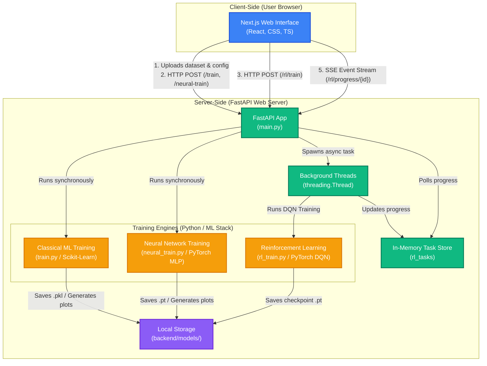

# NEUROFORGE - AI Model Training Platform

NeuroForge is a web-based machine learning platform that enables users to upload datasets, select target variables, train pre-built ML models, compare performance metrics, and generate predictions through an intuitive interface.

## Contents

- [Overview](#overview)
- [Features](#features)
- [How It Works](#how-it-works)
- [Technology Stack](#technology-stack)
- [How to Run](#how-to-run)
- [Machine Learning Workflow](#machine-learning-workflow)
- [Objectives](#objectives)
- [Project Architecture](#project-architecture)
- [Traffic Flow](#traffic-flow)

## Overview

Machine Learning workflows often require programming knowledge, environment setup, and familiarity with multiple libraries. This platform simplifies the process by providing a unified environment where users can train, evaluate, and compare machine learning models directly through a web interface.

Designed for students, researchers, and beginners, the platform abstracts the complexity of machine learning pipelines while still providing meaningful evaluation metrics and visualizations.

---

## Features

### Dataset Management

- Upload custom CSV/Excel datasets
- Use built-in sample datasets (Iris, Breast Cancer)
- Automatic dataset processing and validation

### Model Training

- Select target variables for prediction
- Train classical machine learning models (Random Forest, k-NN, Gradient Boosting)
- Train custom Multi-Layer Perceptron (MLP) Neural Networks
- Train Reinforcement Learning (DQN) agents

### Model Evaluation

- Accuracy/performance score calculation
- Confusion matrix and loss/reward curve generation
- Performance comparison across models

### Data Visualization

- Graphical representation of results (confusion matrix, loss history, reward curves)
- Comparative performance charts
- Live RL training metrics and episode progress streaming

### Prediction System

- Generate predictions using trained models
- Run real-time test simulations for RL agents

---

## How It Works

1. Upload a dataset or select a sample dataset.
2. Choose the target variable for prediction.
3. Select a machine learning model or configure neural network / RL settings.
4. Train the model and view evaluation metrics, visualizations, and predictions.

---

## Technology Stack

| Component        | Technology                                | Description                               |
| ---------------- | ----------------------------------------- | ----------------------------------------- |
| Frontend         | Next.js (TypeScript, React, Tailwind CSS) | Responsive Web User Interface             |
| Backend          | FastAPI (Python)                          | High-performance Web API                  |
| Machine Learning | Scikit-Learn, PyTorch, Gymnasium          | Model definition and training libraries   |
| Data Processing  | NumPy, Pandas                             | Data validation and manipulation          |
| Visualization    | Matplotlib                                | Generating plot graphics (base64 encoded) |

---

## How to Run

### Backend

1. Open a terminal in `backend/`
2. Install dependencies if needed (from the backend folder):

```bash
pip install -r requirements.txt
```

3. Sync dependencies with `uv`:

```bash
uv sync
```

4. Start the FastAPI app with Uvicorn:

```bash
uv run uvicorn main:app --host 0.0.0.0 --port 8000
```

### Frontend

1. Open a terminal in `website/`
2. Install dependencies:

```bash
npm install
```

3. Start the Next.js development server:

```bash
npm run dev
```

---

## Machine Learning Workflow

```text
Dataset Input
      ↓
Target Selection
      ↓
Model Training
      ↓
Performance Evaluation
      ↓
Prediction Generation
      ↓
Visualization & Comparison
```

---

## Objectives

- Simplify machine learning experimentation
- Provide a no-code model training experience
- Enable rapid model evaluation and comparison
- Improve accessibility of machine learning tools
- Support educational and research-oriented use cases

---

## Project Architecture

This section describes the overall architecture of NeuroForge and the responsibilities of each component.

- **Frontend (`website/`)**: Next.js application that provides the user interface for dataset upload, model selection, training control, and results visualization. Runs in the user's browser and communicates with the backend over HTTP/SSE.
- **Backend API (`backend/main.py`)**: FastAPI service that exposes REST endpoints for dataset upload, model training, status queries, and results retrieval. It accepts requests from the frontend and coordinates training workflows.
- **Training Engines (`backend/*.py`)**:
  - `train.py`: Classical machine learning training and evaluation using Scikit-Learn.
  - `neural_train.py`: Custom Multilayer Perceptron (MLP) classification and regression training using PyTorch.
  - `rl_train.py`: Deep Q-Network (DQN) training in background threads using PyTorch.
- **Storage (`backend/models/`)**: Model checkpoints and artifacts are saved on disk for testing and download.

### Architectural Diagram



---

## Traffic Flow

1. **Upload & Setup**: The user opens the web UI and uploads or selects a dataset on the Next.js frontend.
2. **Request Submission**: The frontend sends the dataset/parameters via a POST request to FastAPI (`/train`, `/neural-train`, or `/rl/train`).
3. **Execution**:
   - Classical and Neural jobs run synchronously on the main thread and return evaluation metrics + base64-encoded plot images immediately.
   - RL training starts asynchronously on a spawned background thread.
4. **Real-time Updates**: For RL training, the frontend initiates a Server-Sent Events (SSE) connection to `/rl/progress/{task_id}` to stream real-time episode progress.
5. **Retrieval & Verification**: When training is complete, the user can verify performance or download the trained model file from the generated artifacts in `backend/models/`.
